> [!info] High-Level Overview
> The goal here is to outline the general sequence of events on Event Day to provide further operational context. 
> 
> MAKE SURE TO CAREFULLY EXPLORE

> [!warning] Better in the Dark
> Click the sun to switch to dark mode. 
> 
> If there is text & no diagram, reload the page.

```mermaid
graph TD
    subgraph PreEvent["🌅 Early Morning Setup"]
        S1(["🎽 SWAB Staff Arrives 7:00AM"])
        S2(["🏫 Set Up Check-in Areas"])
        S3(["📋 Volunteer Training"])
        S1 --> S2 --> S3
    end

    subgraph Arrival["👥 Morning Arrivals"]
        A1(["🎓 UGA Mentors Find Partners"])
        A2(["👨‍👩‍👧‍👦 Families Drop Off Students"])
        A3(["📝 Mentor Check-in: Phone #s"])
        A4(["📋 Student Check-in: Name Tags"])
        A5(["🪑 Mentees Breifley Wait for Matching"])
        A6(["🤝 Mentors Line Up for Matching"])
        
        A1 --> A3
        A2 --> A4
        A3 --> A6
        A4 --> A5
    end

    subgraph Matching["🤝 Pairing Process"]
        M1(["👥 Match Students with Mentors"])
        M2(["📸 Trios Proceed to the Auditorium to Wait for Busses"])
        M3(["🚌 Shifts Head by Bus to Walmart"])
        
        M1 --> M2 --> M3
    end

    subgraph Shopping["🛍️ Walmart Experience"]
        W1(["🚌 Short Bus Ride"])
        W2(["📋 Enter Store"])
        W3(["🛒 Shop with Mentors"])
        W4(["💳 Checkout With SWAB Finance"])
        W5(["📦 Get Wrapping Paper "])
        W6(["🚌 Board Return Bus"])
        
        W1 --> W2 --> W3 --> W4
        W4 --> W5 --> W6
    end

    subgraph Return["🏫 Back at School"]
        R1(["🍕 Lunch in Cafeteria"])
        R2(["🎨 Head to the Gym for Fun and Games"])
        
        R1 --> R2
    end

    subgraph Departure["👋 End of Day"]
        D1(["👨‍👩‍👧‍👦 Parents Arrive for Checkout"])
        D2(["📝 Check-out Process"])
        D3(["🎁 Collect Wrapped Gifts"])
        D4(["🚗 Families Depart"])
        D5(["📋 Mentors Return Packets"])
        
        D1 --> D2 --> D3 --> D4
        D2 --> D5
    end

    S3 --> Arrival
    A5 & A6 --> M1
    M3 --> W1
    W6 --> R1
    R2 --> D1

    classDef default fill:#2a2a2a,stroke:#00ab51,color:white
    classDef transition fill:#00ab51,stroke:#ffffff,color:white
    classDef phase fill:#1a1a1a,stroke:#00ab51,color:white

    class PreEvent,Arrival,Matching,Shopping,Return,Departure phase
    class S1,M1,W1,R1,D1 transition
```

