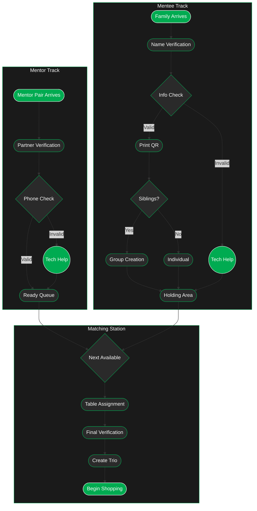

---
tags:
  - checkin
---
> [!info] Check In Components
> Check in is a multiangle process where we have the most complexity so, I broke it down further.
> 
> Use the graph below as a reference for the whole check in system
### [[1.1 Mentor CI]]
### [[1.2 Mentee CI]]
### [[1.3 Trio Matching]]

---
## Check In Flow Overview
> [!warning] Better in the Dark
> Click the sun to switch to dark mode

