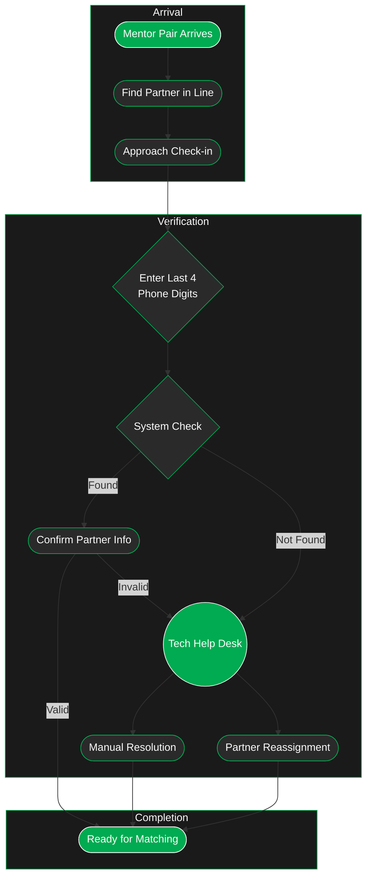

---
tags:
  - checkin
---
> [!warning] Better in the Dark
> Click the sun to switch to dark mode. 
> 
> If there is text & no diagram, reload the page.

---
# Exploration
### 1. Initial Arrival
- Mentor pairs arrive at the check-in area together
- Partners locate each other in the designated waiting area
- Pairs approach check-in station as a unit
### 2. Verification Process
- **Identity Verification Method**
    - Either partner provides last 4 digits of their phone number
    - System fetches both partners' information simultaneously
    - Check-in attendant confirms information matches both present mentors
### 3. System Response Scenarios
-  Successful Verification
	- System finds matching mentor pair
	- Information is confirmed by check-in attendant
	- Pair is cleared for matching process
- Verification Issues
	- System cannot find matching information
	- Partner information doesn't match present mentors
	- Partner is missing or incorrect
### 4. Tech Help Desk Support
- Dedicated station for resolving check-in issues
- Staffed by skilled internal members
- Handles:
    - Manual partner verification
    - Partner reassignments if needed
    - System troubleshooting
    - Exception processing