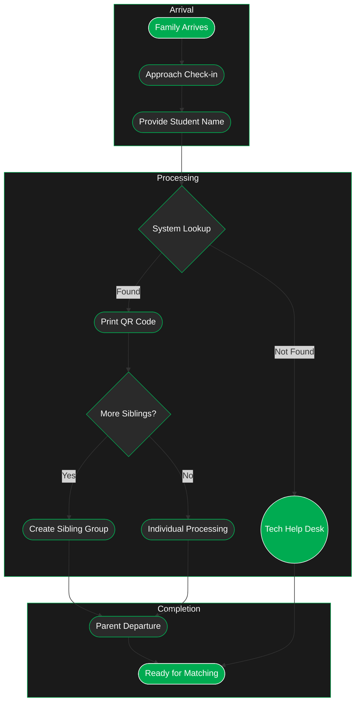

---
tags:
  - checkin
---

> [!warning] Better in the Dark
> Click the sun to switch to dark mode. 
> Reload the page if there is text below and the diagram will show.

---
# Exploration
### 1. Initial Arrival
- Family arrives with mentee and any siblings
- Parent accompanies children to check-in station
- Each mentee's information will be processed individually
### 2. Check-in Process
- **Identity Verification Method**
    - Parent provides mentee's name
    - System performs information lookup
    - Check-in attendant confirms details match registration
### 3. QR Code Generation
- System generates unique QR code for each mentee
- QR code is printed and attached to mentee packet
- Code will be used for tracking throughout event day
- Contains mentee's unique identifier and essential information
### 4. Sibling Group Handling
- Optional process for families with multiple participating children
- **Sibling Group Creation**
    - Groups are formed after all siblings check in
    - Only affects check-out process
    - Maintains individual matching process integrity
- System tags all members of sibling group for coordinated check-out
- Ensures families can pick up all children together
### 5. Completion Steps
- Parent verifies all information is correct
- Sibling groups are confirmed if applicable
- Parent departs after successful check-in
- Mentees move to matching area
- QR codes are ready for tracking system integration