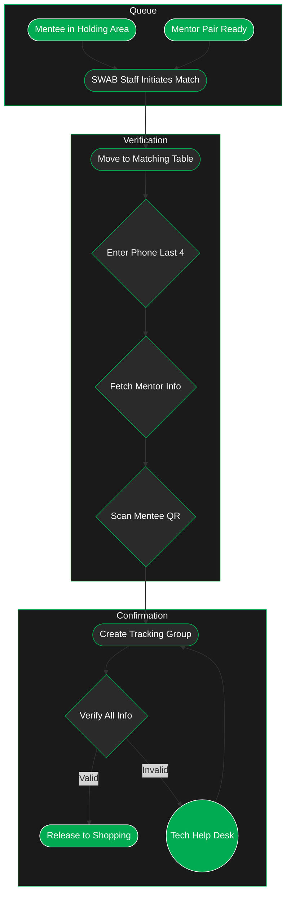

---
tags:
  - checkin
---
> [!warning] Better in the Dark
> Click the sun to switch to dark mode. 
> Reload the page if there is text below and the diagram will show.

---
# Exploration
### 1. Queue Management
- Verified mentees wait in designated holding area
- Confirmed mentor pairs wait in separate staging area
- SWAB staff coordinates selection of next available pairs
### 2. Initial Matching
- **Staff-Guided Process**
    - Staff member selects next available mentor pair
    - Identifies next mentee in queue
    - Escorts group to matching table
    - Ensures orderly and efficient pairing
### 3. Verification Process
- **Technical Confirmation**
    - Mentors provide last four digits of phone number
    - System retrieves confirmed mentor pair information
    - Staff scans mentee's QR code
    - System validates all participants' information
### 4. Tracking Group Creation
- System links all three participants:
    - Both mentors
    - Mentee
    - Creates unified tracking group
    - Assigns unique group identifier
- Establishes basis for checkpoint tracking
### 5. Final Confirmation
- Verify all information matches
- Confirm tracking group creation
- Clear group for shopping phase
- Handle any last-minute issues via tech help desk