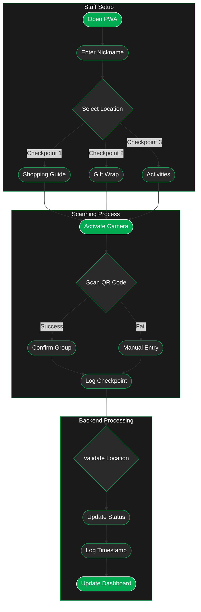

---
tags:
  - checkpoint
---
> [!warning] Better in the Dark
> Click the sun to switch to dark mode. 
> 
> If there is text & no diagram, reload the page.

---
# Exploration
### 1. PWA Interface Setup
- **Initial Configuration**
    - Staff opens Progressive Web App
    - Enters identifying nickname for system tracking
    - Selects specific checkpoint location
    - Interface adapts to chosen checkpoint
### 2. Checkpoint Locations
- **Three Strategic Points**
    - Checkpoint 1: Scanned when students leave the checkin auditorium
    - Checkpoint 2: Scanned when getting back on the bus from Walmart
    - Checkpoint 3: Scanned on the way into the gym (final destination)
- Each checkpoint tracks different event phase
- Location selection determines data context

### 3. Scanning Process
- **QR Code Scanning**
    - Camera interface for quick scanning
    - Automatic group information retrieval
    - Manual entry option for backup
    - Immediate confirmation display
- **Validation Steps**
    - Verifies group is at correct checkpoint
    - Confirms scanning staff member identity
    - Records timestamp and location

### 4. System Integration
- **Real-time Processing**
    - Updates group status in database
    - Records checkpoint completion
    - Timestamps each interaction
    - Updates monitoring dashboard
- **Error Prevention**
    - Validates correct checkpoint sequence
    - Prevents duplicate scans
    - Flags unusual patterns