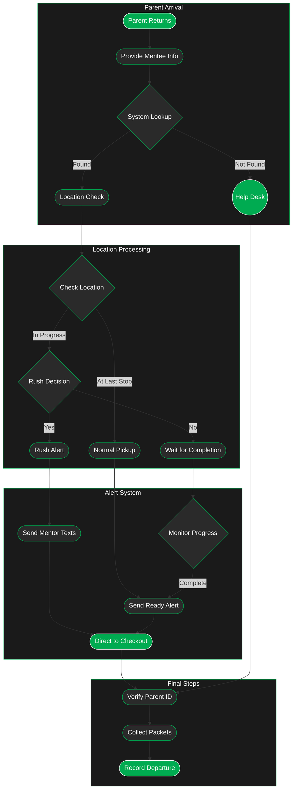

---
tags:
  - checkout
---
> [!warning] Better in the Dark
> Click the sun to switch to dark mode

---
# Exploration
### 1. Parent Return Process
- **Initial Steps**
    - Parent arrives at checkout desk
    - Provides mentee name or number
    - System performs lookup of mentee(s)
    - Includes sibling group checking
- **Location Verification**
    - System shows last checkpoint location
    - Displays current status in event flow
    - Indicates remaining activities if any
### 2. Pickup Options
- **Standard Process**
    - When mentee at final checkpoint
    - Normal alert sequence initiated
    - Orderly completion of activities
- **Rush Process**
    - Optional early pickup flow
    - Parent can request immediate return
    - System handles expedited process
- **Wait Option**
    - Parent can choose to wait
    - System monitors progress
    - Alerts when naturally complete
### 3. Notification System
- **Text Alert Features**
    - Automated messages to mentors
    - Location-specific instructions
    - Clear pickup point directions
- **Sibling Coordination**
    - Grouped notifications for siblings
    - Synchronized pickup timing
    - Single checkout process
### 4. Final Verification
- **Security Measures**
    - Parent ID verification
    - Sibling group confirmation
    - Packet collection and checking
- **System Updates**
    - Record departure time
    - Update all relevant statuses
    - Close out tracking records