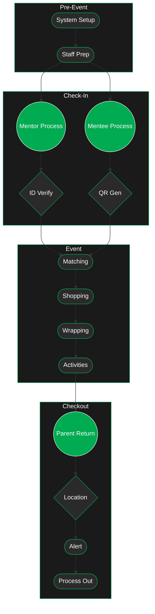

---
tags:
  - homepage
  - prototype
---
> [!info] High-Level Overview
> This folder is dedicated to exploring the potential aspects of a theoretical solution to use as a starting point for project planning.
> 
> Here we will detail the desired actions of the EDMS but also the methods to get there.
## [[1. Check In]]
- Exploration of the check in technical prototype
## [[2. Check Point]]
- Exploration of the check point technical prototype
## [[3. Check Out]]
- Exploration of the check out technical prototype

---
## Prototype System Overview (Birdseye)

> [!warning] Better in the Dark
> Click the sun to switch to dark mode

